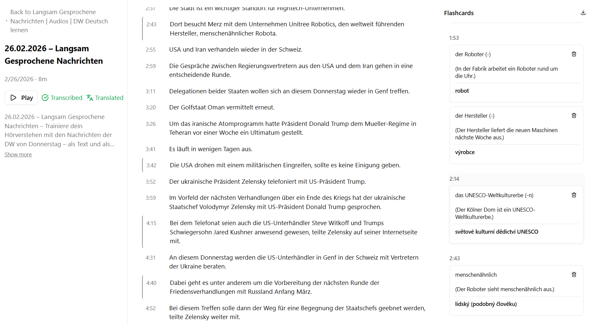

# Podcast Vocabulary Extractor

Personal app for learning German vocabulary from podcasts. Subscribe to RSS feeds, download episodes locally, play them with a persistent audio player, transcribe using local whisper.cpp, and translate segments from German to Czech.



## Features

- RSS feed subscription with auto-download of latest episodes
- Audio player with speed control, rewind, position memory, and seeking
- Local transcription via whisper.cpp (German, word-level timestamps)
- Karaoke-style transcript display with click-to-play segments
- German→Czech translation via OpenAI
- Flashcard creation from transcript words
- Anki Export

## Tech Stack

Next.js 16 (App Router) · TypeScript · Tailwind CSS v4 · Shadcn UI · Drizzle ORM · SQLite · whisper.cpp · OpenAI

## Setup

```bash
cp .env.example .env.local   # Add OPENAI_API_KEY for translation
docker compose up
```

App runs at [http://localhost:3000](http://localhost:3000). Whisper model downloads automatically on first start.

Data is stored in `/data` (SQLite database + downloaded audio files + whisper model).
